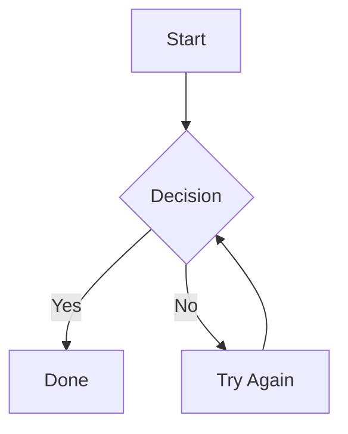

# PM Toolkit

[](https://github.com/aaronkwhite/pm-toolkit/releases)
[](https://github.com/aaronkwhite/pm-toolkit/blob/main/LICENSE)
[](https://github.com/aaronkwhite/pm-toolkit/blob/main/CHANGELOG.md)
[](https://getpmtoolkit.com)

> **Free Forever.** No trial period. No yearly fee. No read-only mode. Just pure, unadulterated rich editing in your IDE. Every save is validated to protect your files from corruption.

**Visual markdown editor, kanban boards, and file viewers for Cursor** — built for product managers and teams who work alongside AI.

Draft specs with Cursor's agent, then polish them visually. Keep planning docs, task boards, and reference files next to your code. Everything stays in plain text—portable, version-controlled, and yours.

- **WYSIWYG Markdown** — Slash commands, templates, tables, Mermaid diagrams
- **Kanban Boards** — Drag-and-drop task management backed by markdown
- **File Viewers** — PDF, Word, Excel, CSV without leaving your editor

#### Support the project

If PM Toolkit saves you time, consider buying me a coffee. Your support helps keep this project maintained and free for everyone.

<a href="https://buymeacoffee.com/aaronkwhite">
  
</a>

## 🚀 Features

### ✍️ WYSIWYG Markdown Editor

Edit markdown files visually. What you see is what you get—no more switching between raw text and preview.

- **Slash commands** — Type `/` to insert headings, lists, tables, code blocks, links, and more
- **Bubble menu** — Select text to see a floating toolbar for quick formatting
- **Templates** — Create reusable templates and insert them via `/` commands
- **Rich formatting** — Bold, italic, strikethrough, code, links with familiar keyboard shortcuts
- **Image support** — Paste, drag and drop, or browse for images; resize with handles; align left/center/right via popover toolbar
- **Block handles** — Drag blocks to reorder, click `+` to insert new content
- **Document outline** — Collapsible heading sidebar for quick navigation
- **Tables** — Create and edit tables visually with Tab/Shift+Tab navigation, drag-to-reorder rows and columns, right-click context menu
- **Task lists** — Interactive checkboxes that save to standard markdown
- **Mermaid diagrams** — Flowcharts, sequence diagrams, and more render inline with fit-to-view default
- **Smart navigation** — Escape code blocks and tables with arrow keys or Cmd+Enter

### 📋 Kanban Boards

Turn any markdown file into a visual task board. Your data stays in plain text—always portable, always yours.

- **Drag and drop** — Move cards between columns
- **Card details** — Click to expand and edit with full formatting
- **Image support** — Paste images directly into cards
- **Auto-complete columns** — Cards automatically mark as done when moved
- **Thumbnails** — See image previews on cards

Create a `.kanban` file or right-click any `.md` file and select "Open as Kanban Board."

### 📄 File Viewers

View common file types without leaving your editor:

- **PDF** — Page navigation, zoom, rotation
- **Word (.docx)** — View documents with formatting preserved
- **Excel (.xlsx)** — Browse spreadsheets with sheet tabs
- **CSV/TSV** — Sortable tables with auto-detected delimiters

## Installation

**[Visit the website →](https://getpmtoolkit.com)**

### From Cursor Marketplace

Search for "PM Toolkit" in the Extensions view (`Cmd+Shift+X` / `Ctrl+Shift+X`).


## Getting Started

### Markdown Editing

1. Open any `.md` file
2. Start typing—formatting appears as you write
3. Type `/` at the start of a line to see available blocks

**Keyboard shortcuts:**
- `Cmd/Ctrl + B` — Bold
- `Cmd/Ctrl + I` — Italic
- `Cmd/Ctrl + K` — Insert link
- `Cmd/Ctrl + Z` — Undo
- `Cmd/Ctrl + Shift + Z` — Redo
- `Cmd/Ctrl + Enter` — Exit code block or table (insert paragraph below)
- `Tab` / `Shift+Tab` — Navigate table cells (Tab in last cell exits table)
- `Arrow Up` — Exit code block from top
- `Arrow Down` — Exit code block from bottom

### Kanban Boards

Create a new file with the `.kanban` extension:

```markdown
## To Do

- [ ] First task
- [ ] Second task
  Additional notes go here

## In Progress

- [ ] Working on this

## Done [auto-complete]

- [x] Completed task
```

Cards are standard markdown checkboxes. Columns are `##` headings. Add `[auto-complete]` to a column name to automatically check off cards moved there.

### Mermaid Diagrams

Insert diagrams using the `/mermaid` slash command or write them directly:

~~~markdown

~~~

Hover over a diagram to see controls for editing or switching between scroll and fit modes.

## Templates

Create reusable document templates that appear in the slash command menu.

1. Create a folder with your template `.md` files
2. Run **PM Toolkit: Set Template Folder** from the Command Palette (`Cmd/Ctrl + Shift + P`)
3. Select your templates folder
4. Type `/` in any document to see your templates listed

Templates are regular markdown files. The filename becomes the template name in the menu.

## Configuration

Access settings via the **PM Toolkit Settings** command (from the editor `...` menu or Command Palette), or through `Code` → `Settings` → `Extensions` → `PM Toolkit`.

| Setting | Description | Default |
|---------|-------------|---------|
| `pmtoolkit.editorFontSize` | Font size for the editor and kanban board (10-24px) | 14 |
| `pmtoolkit.templateFolder` | Path to folder containing template markdown files | — |
| `pmtoolkit.templateWatchEnabled` | Auto-reload templates when folder contents change | true |
| `pmtoolkit.kanbanDefaultColumns` | Comma-separated list of columns for new boards | Backlog, In Progress, Done |
| `pmtoolkit.kanbanShowThumbnails` | Show image thumbnails on kanban cards | true |
| `pmtoolkit.kanbanSaveDelay` | Delay before saving kanban changes (50-2000ms) | 150 |
| `pmtoolkit.imageAssetsPath` | Directory where uploaded images are saved (relative to the document) | assets |

## Built With

PM Toolkit is built on solid open-source foundations:

| Library | Purpose | License |
|---------|---------|---------|
| [Tiptap](https://tiptap.dev) | Rich text editor framework | MIT |
| [ProseMirror](https://prosemirror.net) | Editor toolkit (powers Tiptap) | MIT |
| [dnd-kit](https://dndkit.com) | Drag and drop | MIT |
| [Mermaid](https://mermaid.js.org) | Diagrams from text | MIT |
| [Lucide](https://lucide.dev) | Icons | ISC |
| [PDF.js](https://mozilla.github.io/pdf.js/) | PDF rendering | Apache 2.0 |
| [Mammoth](https://github.com/mwilliamson/mammoth.js) | Word document conversion | BSD-2 |
| [SheetJS](https://sheetjs.com) | Excel parsing | Apache 2.0 |
| [Papa Parse](https://www.papaparse.com) | CSV parsing | MIT |

## Contributing

Contributions are welcome! Please:

1. Check [existing issues](https://github.com/aaronkwhite/pm-toolkit/issues) before opening a new one
2. For bugs, include steps to reproduce and your environment details
3. For features, describe the use case and why it would help

### Development Setup

```bash
# Clone the repository
git clone https://github.com/aaronkwhite/pm-toolkit.git
cd pm-toolkit

# Install dependencies
npm install

# Start development (watches for changes)
npm run watch

# In Cursor: Press F5 to launch Extension Development Host
```

### Running Tests

```bash
# Run all e2e tests
npm run test:e2e

# Run tests with UI
npm run test:e2e:ui
```

## Support

- **Bug reports** — [Open an issue](https://github.com/aaronkwhite/pm-toolkit/issues/new?template=bug_report.md)
- **Feature requests** — [Open an issue](https://github.com/aaronkwhite/pm-toolkit/issues/new?template=feature_request.md)
- **Questions** — [Start a discussion](https://github.com/aaronkwhite/pm-toolkit/discussions)

## License

**PM Toolkit is Free Forever!** No read-only modes, no purchasing a license, pure unadulterated rich editing in your IDE.

- No trial period
- No yearly fee
- No read-only mode

MIT — see [LICENSE](LICENSE) for details.

---

Made for people who live in their editor.
