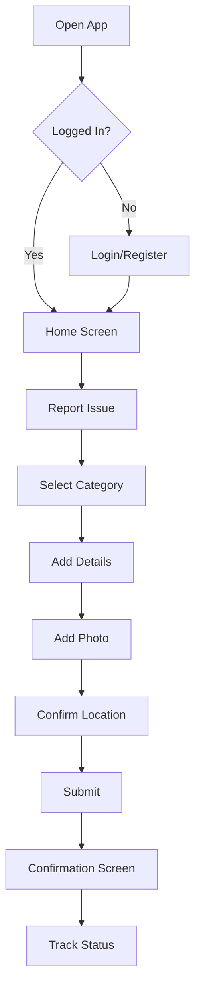

# Pawnee 311 Mobile App

**Product Owner:** Leslie Knope
**Last Updated:** {{date}}
**Status:** In Development

## Overview

The Pawnee 311 app will allow residents to report issues, request services, and stay connected with city government—all from their phones. This is part of our broader Digital Pawnee initiative to make city services accessible to everyone.

> "Every resident deserves a direct line to their government. This app is that line." — Leslie Knope

## Problem Statement

Currently, residents must call during business hours or visit City Hall in person to report issues like potholes, broken streetlights, or raccoon infestations. This creates barriers for working families and limits our ability to respond quickly.

## User Stories

### Resident Stories

- [ ] As a resident, I want to report a pothole so that it gets fixed before someone damages their car
- [ ] As a resident, I want to upload a photo of the issue so that crews know exactly what they're dealing with
- [ ] As a resident, I want to track my request status so I know when to expect resolution
- [ ] As a resident, I want to receive notifications when my issue is resolved
- [x] As a resident, I want to see a map of reported issues in my neighborhood

### Staff Stories

- [ ] As a parks employee, I want to see all requests assigned to my department
- [ ] As a dispatcher, I want to route requests to the appropriate team
- [x] As a manager, I want to see resolution time metrics

## Requirements Matrix

| Requirement | Priority | Complexity | Sprint |
|-------------|----------|------------|--------|
| Issue submission form | P0 | Low | 1 |
| Photo upload | P0 | Medium | 1 |
| GPS location capture | P0 | Medium | 1 |
| Status tracking | P1 | Medium | 2 |
| Push notifications | P1 | High | 2 |
| Issue map view | P2 | Medium | 3 |
| Admin dashboard | P1 | High | 3 |

## User Flow

## Acceptance Criteria

### Issue Submission
- [ ] User can select from predefined categories (Pothole, Streetlight, Graffiti, Parks, Other)
- [ ] User can add free-text description (max 500 chars)
- [ ] User can attach up to 3 photos
- [ ] Location auto-populates from GPS with option to adjust on map
- [ ] Submission works offline and syncs when connected

### Notifications
- [ ] User receives confirmation email/push when submitted
- [ ] User receives update when status changes
- [ ] User receives notification when resolved

## Out of Scope (v1)

- Integration with Eagleton systems (they can build their own app)
- Permit applications
- Bill payment
- Event registration

## Success Metrics

| Metric | Target | Current |
|--------|--------|---------|
| App downloads (90 days) | 5,000 | — |
| Issues reported via app | 40% of total | — |
| Avg resolution time | < 72 hours | 96 hours |
| User satisfaction (NPS) | > 50 | — |

## Open Questions

1. Do we need Spanish language support for v1? (Check with Ann on demographics)
2. Integration with existing 311 phone system—Tom to investigate
3. Hosting: AWS or city data center? (Ben reviewing costs)

## Appendix

### Competitive Analysis

Looked at similar apps from Indianapolis, Chicago, and (reluctantly) Eagleton. Key learnings:
- Photo upload is table stakes
- Map view drives engagement
- Push notifications reduce "where's my request" calls by 60%

---

*Document maintained by Parks & Recreation Department*
