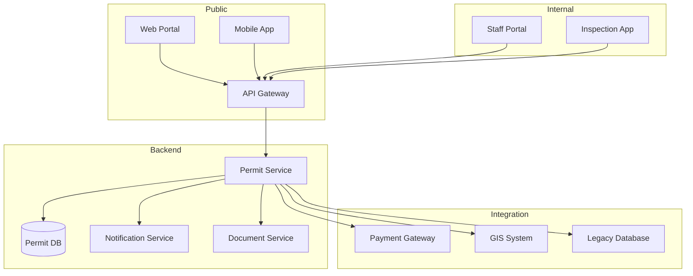
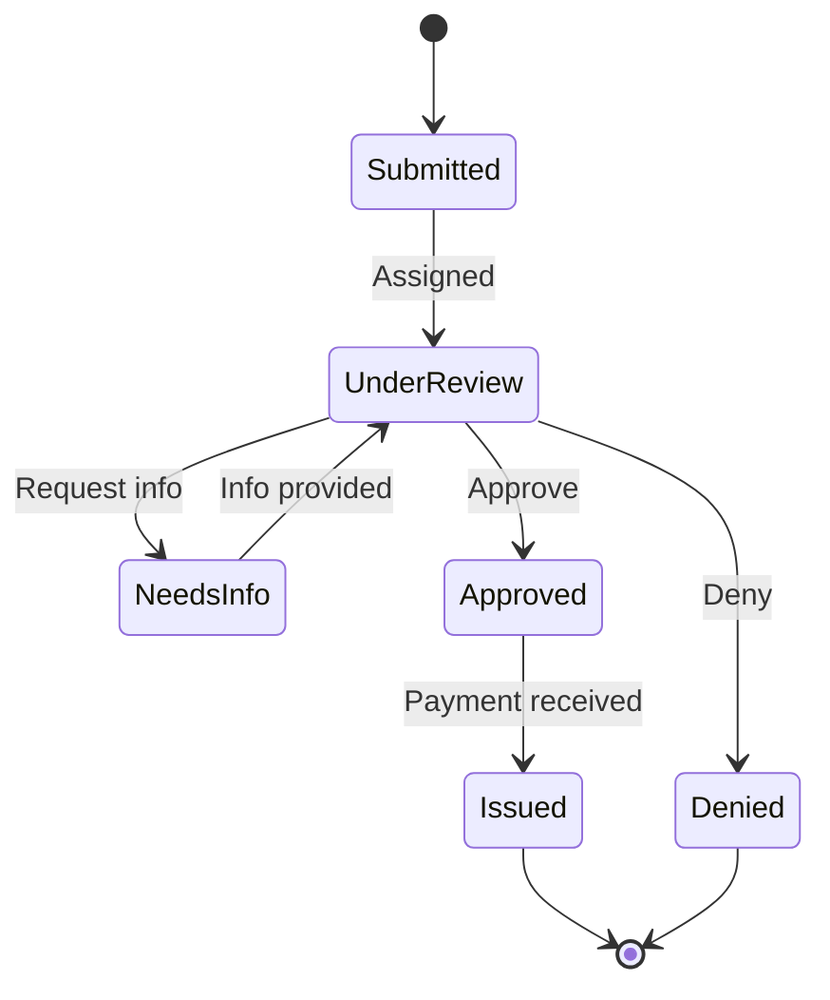
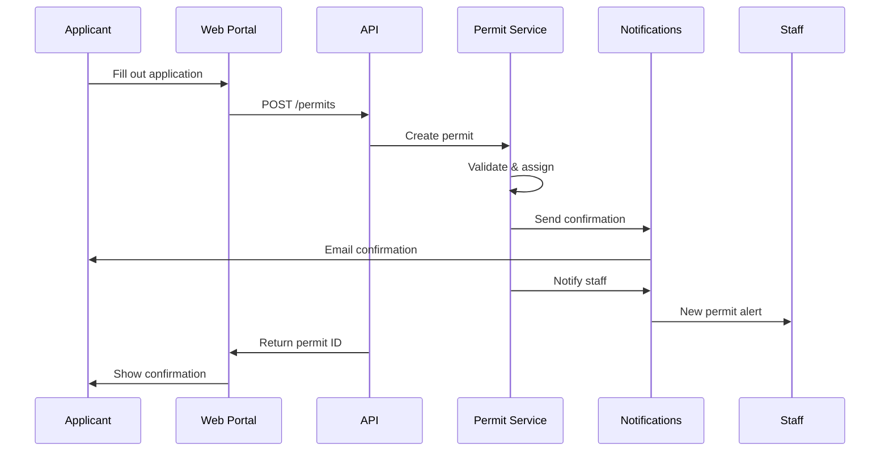
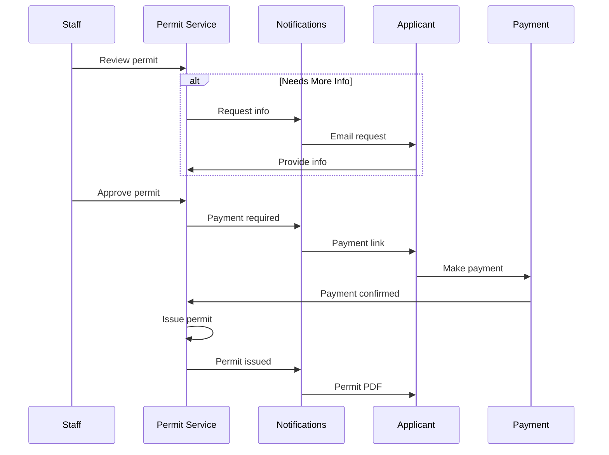
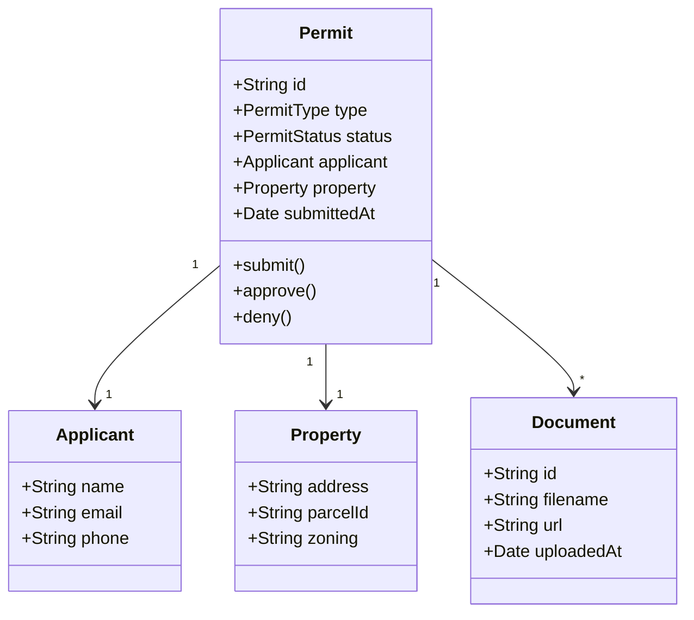

# Technical Design: Pawnee Permit System

**Author:** Ben Wyatt
**Reviewers:** Leslie Knope, April Ludgate
**Status:** Approved
**Last Updated:** {{date}}

---

## Overview

This document describes the technical architecture for the new Pawnee Online Permit System, replacing the current paper-based process that involves 17 forms, 4 departments, and an average of 23 days to complete.

### Goals

- Reduce permit processing time from 23 days to 5 days
- Enable online submission and tracking
- Automate routing between departments
- Integrate with existing city systems

### Non-Goals

- Replacing in-person inspections
- Handling Eagleton permits (never)
- Ron Swanson's approval (impossible)

---

## System Architecture



---

## API Design

### Endpoints

| Method | Endpoint | Description |
|--------|----------|-------------|
| POST | `/permits` | Submit new permit application |
| GET | `/permits/{id}` | Get permit details |
| GET | `/permits?status={status}` | List permits by status |
| PUT | `/permits/{id}/status` | Update permit status |
| POST | `/permits/{id}/documents` | Upload supporting documents |
| GET | `/permits/{id}/history` | Get permit activity history |

### Permit Lifecycle



---

## Data Model

### Permit Entity

```json
{
  "id": "PRM-2024-001234",
  "type": "BUILDING",
  "status": "UNDER_REVIEW",
  "applicant": {
    "name": "Tom Haverford",
    "email": "tom@entertainment720.com",
    "phone": "555-0147"
  },
  "property": {
    "address": "123 Main St, Pawnee, IN",
    "parcelId": "PAW-445-223",
    "zoning": "COMMERCIAL"
  },
  "description": "Interior renovation for new business",
  "submittedAt": "2024-10-15T09:30:00Z",
  "assignedTo": "leslie.knope@pawnee.gov",
  "documents": [...],
  "fees": {
    "base": 150.00,
    "inspection": 75.00,
    "total": 225.00
  }
}
```

### Permit Types

| Type | Code | Base Fee | Review SLA |
|------|------|----------|------------|
| Building | BUILDING | $150 | 5 days |
| Electrical | ELECTRICAL | $75 | 3 days |
| Plumbing | PLUMBING | $75 | 3 days |
| Special Event | EVENT | $50 | 7 days |
| Food Service | FOOD | $100 | 5 days |
| Sign | SIGN | $25 | 2 days |

---

## Sequence Diagrams

### Permit Submission Flow



### Review & Approval Flow



---

## Security Considerations

- All API endpoints require authentication
- PII encrypted at rest and in transit
- Staff access controlled by department role
- Audit log for all permit actions
- Rate limiting on public endpoints

---

## Integration Points

### Existing Systems

| System | Integration | Method |
|--------|-------------|--------|
| GIS | Property lookup | REST API |
| Finance | Payment processing | Webhook |
| Legacy permits | Historical data | Nightly batch |
| Email | Notifications | SMTP |

### Third Party

- **Stripe** for payment processing
- **SendGrid** for transactional email
- **AWS S3** for document storage

---

## Rollout Plan

### Phase 1: Soft Launch (Week 1-2)
- Internal staff testing
- 10 beta applicants (friends of Parks Dept)

### Phase 2: Limited Release (Week 3-4)
- Building permits only
- Monitor and fix issues

### Phase 3: Full Launch (Week 5+)
- All permit types
- Marketing push
- Retire paper forms

---

## Open Questions

1. ~~Do we sunset paper forms immediately or run parallel?~~ *Parallel for 90 days*
2. Integration with county systems—needed for Phase 2?
3. Mobile app or responsive web only for v1?

---

## Appendix: Class Diagram



---

*"This system will save Pawnee residents approximately 47,000 hours per year in waiting at City Hall. That's time they can spend enjoying our beautiful parks." — Leslie Knope*
